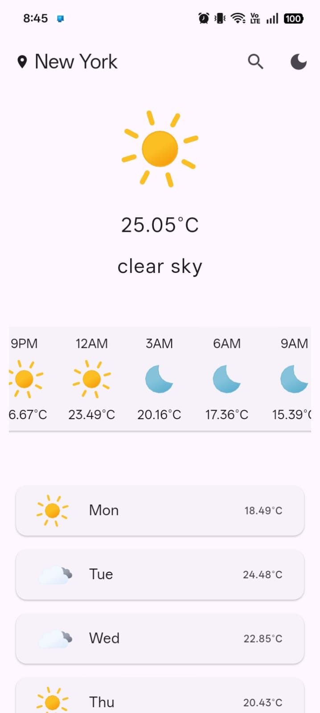
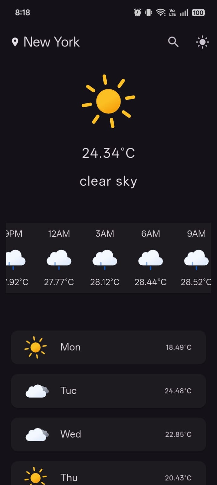

# 🌦️ Weatherly

A clean and responsive weather application built with **Flutter** that provides real-time weather updates, hourly forecasts, and a 5-day forecast using the OpenWeather API.

## ✨ Features

- 🔍 Search weather by city
- 🌡️ Real-time weather and temperature
- 🕒 Hourly weather forecast
- 📅 5-day weather forecast
- 🌙 Light & Dark mode
- 💾 Remembers the last searched city
- ⚠️ Error handling for invalid cities, timeouts, and network issues
- 🎨 Animated weather icons using Lottie

## 📸 Screenshots

<p align="center">
  
  
  
</p>

### Error Handling

<p align="center">
  
</p>

## 🛠️ Tech Stack

- Flutter
- Dart
- OpenWeather API
- HTTP
- Shared Preferences
- flutter_dotenv
- Lottie Animations

## 🚀 Getting Started

Clone the repository:

```bash
git clone https://github.com/zohras0112-ux/weatherly.git
```

Install dependencies:

```bash
flutter pub get
```

Create a `.env` file in the project root:

```env
WEATHER_API_KEY=YOUR_OPENWEATHER_API_KEY
```

Run the app:

```bash
flutter run
```

## 📂 Project Structure

```text
lib/
├── data/
│   ├── model/
│   ├── service/
│   └── notifiers.dart
├── util/
├── views/
│   ├── pages/
│   └── widgets/
└── main.dart
```

## 📄 License

This project is built for learning and portfolio purposes.
